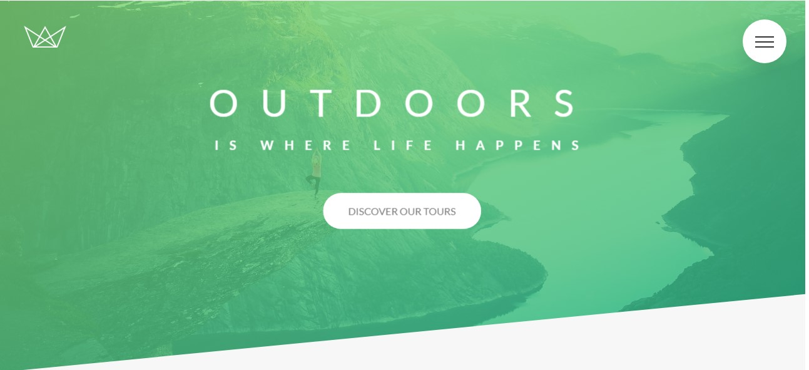
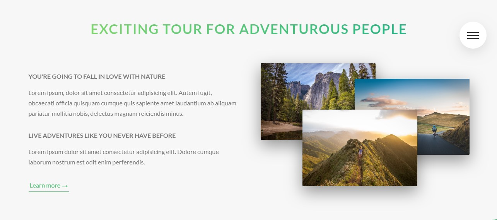
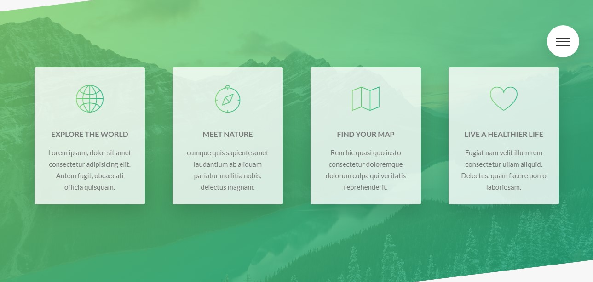
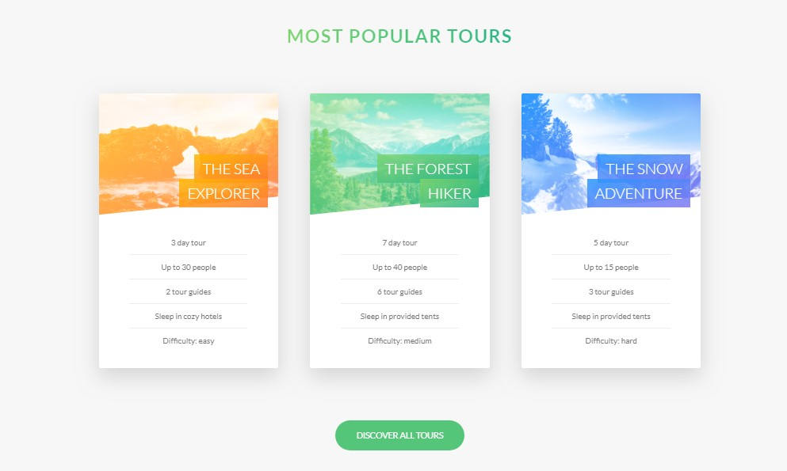
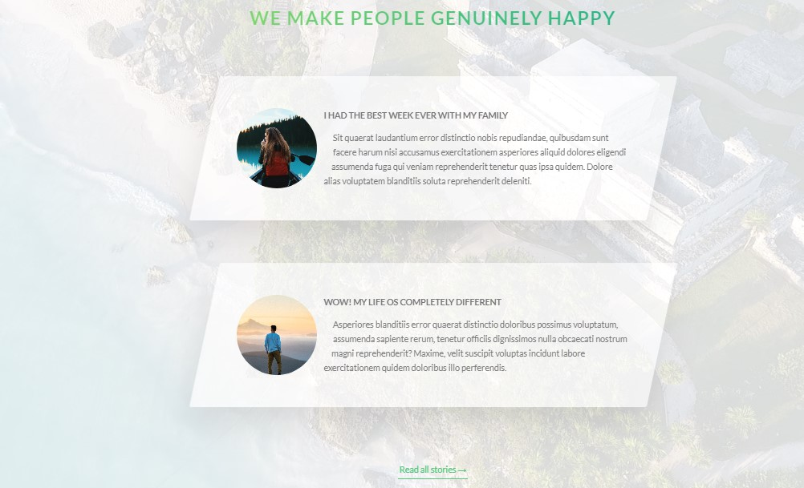
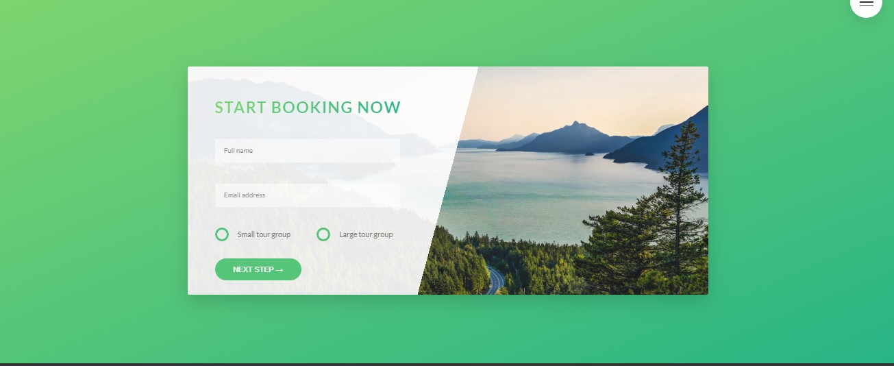
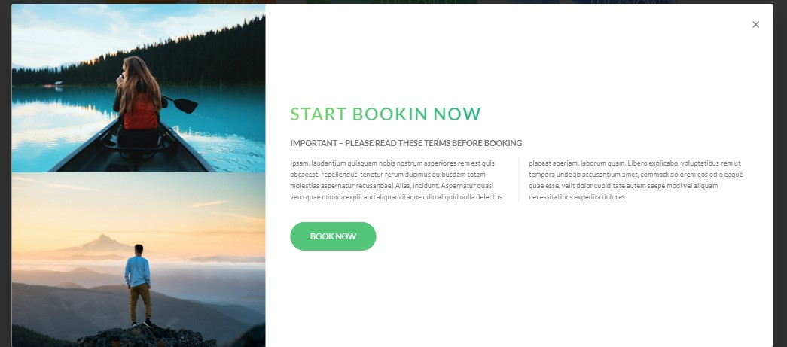
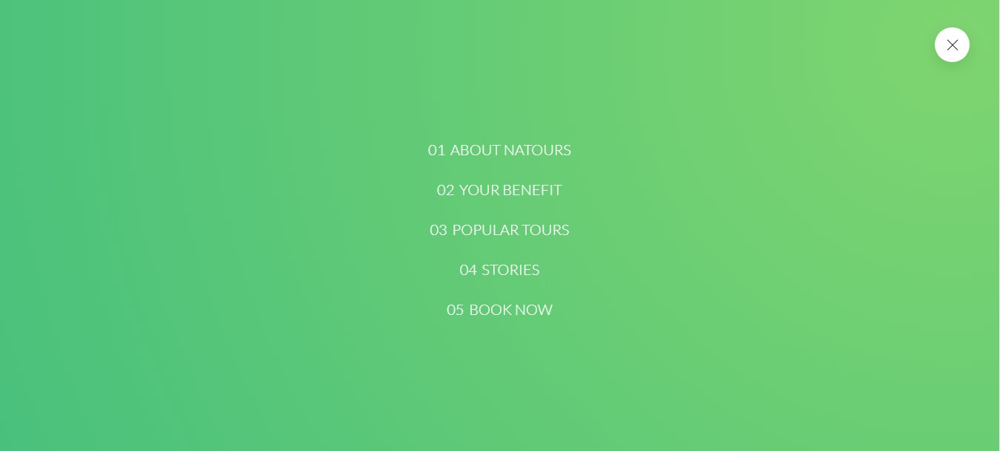
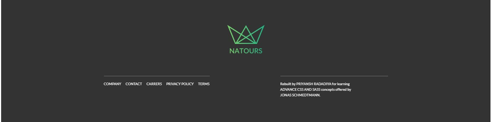

# 

#### Natours is a cool project rebuild for learning CSS and Sass concepts.

This is a responsive website built by using pure HTML, CSS, and Sass. I have learned many different concepts and applied to this project.

- <a href="https://css-tricks.com/bem-101/">BEM</a> (Block, Element, Modifier) methodology.
- Sass <a href="https://sass-guidelin.es/#the-7-1-pattern">7-1 pattern</a>
- <a href="http://www.jondjones.com/frontend/css/architecture/three-fundamentals-of-writing-good-html-and-css">Three fundamental of writing good HTML and CSS.</a>
- Complex advanced CSS tricks and properties.

### Website View

There are 6 sections in this project excluding navigation, footer, and popup.

- Hero
  - 
- About Natours
  - 
- Your Benefit
  - 
- Popular Tours
  - 
- Stories
  - 
- Book Now
  - 
- Booking popup
  - 
- Navigation
  - 
- Footer
  - 

### Technologies

##### Node.js, Express.js, HTML, CSS, Sass

### <a href="https://twitter.com/jonasschmedtman">Jonas Schmedtman</a>

Natours is a theme designed by <a href="http://jonas.io/"><strong>Jonas Schmedtmann</a></strong>.
This project is rebuilt for learning <a href="http://www.udemy.com/advanced-css-and-sass/">Advance CSS and Sass</a> concepts.

